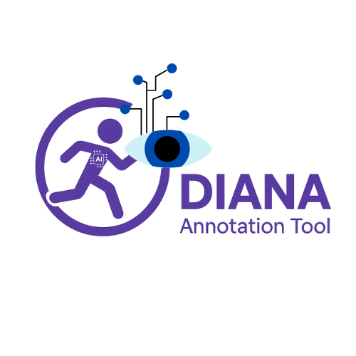

<p align="center">
  
</p>

<h1 align="center">DIANA Annotation Tool</h1>

<p align="center">
  Plataforma web para segmentación y anotación de habilidades motoras TGMD-3 en videos de niños.
</p>

---

## Descripción

**DIANA Annotation Tool** es una herramienta web diseñada para la anotación manual de los 13 movimientos del Test de Desarrollo Motor Grueso (TGMD-3) en videos. Está pensada para flujos clínicos, educativos y de investigación, permitiendo:

- Cargar videos locales (MP4 u otros formatos compatibles)
- Marcar segmentos de inicio/fin con precisión
- Etiquetar cada segmento con una de las 13 habilidades TGMD-3
- Asignar repeticiones automáticamente por acción
- Exportar anotaciones a CSV con IDs oficiales

## Características principales

- **Reproductor de video** con controles de velocidad (0.25x - 2x), saltos ±2s y navegación precisa
- **Timeline visual** estilo Gantt con filas por acción anotada
- **Atajos de teclado** para anotación rápida
- **Autenticación** con Firebase (email/contraseña)
- **Export CSV** con columnas: `video_id`, `file_path`, `action`, `start_sec`, `end_sec`, `repetition_id`, `annotator_id`, `notes`

## Stack tecnológico

- **Frontend**: React + TypeScript + Vite
- **Autenticación**: Firebase Auth
- **Estilos**: CSS custom (responsive, mobile-first)
- **Reproductor**: HTML5 `<video>` nativo

## Estructura del proyecto

```
tgdm-annotator/
├── public/
│   ├── logo.png
│   └── icon-*.png          # Iconos UI
├── src/
│   ├── components/
│   │   ├── ActionTimeline.tsx
│   │   ├── AnnotationForm.tsx
│   │   ├── LoginCard.tsx
│   │   ├── PlaybackControls.tsx
│   │   ├── SegmentList.tsx
│   │   ├── SegmentTrack.tsx
│   │   ├── ShortcutsHelp.tsx
│   │   ├── Timeline.tsx
│   │   ├── VideoLoader.tsx
│   │   └── VideoPlayer.tsx
│   ├── constants/
│   │   └── actions.ts      # Definición TGMD-3 (IDs, etiquetas, colores)
│   ├── hooks/
│   │   ├── useAuth.ts
│   │   ├── useKeyboardShortcuts.ts
│   │   └── useThumbnailGenerator.ts
│   ├── utils/
│   │   ├── csvExport.ts
│   │   └── time.ts
│   ├── firebase.ts         # Configuración Firebase
│   ├── types.ts
│   ├── App.tsx
│   ├── App.css
│   ├── index.css
│   └── main.tsx
├── .env                    # Variables de entorno (NO commitear)
├── .gitignore
├── package.json
├── tsconfig.json
└── vite.config.ts
```

## Requisitos previos

- Node.js 20.19+ o 22.12+
- Cuenta en [Firebase](https://console.firebase.google.com/)

## Configuración de Firebase

1. Crear proyecto en [Firebase Console](https://console.firebase.google.com/)
2. Ir a **Authentication** → **Sign-in method** → Habilitar **Email/Password**
3. Ir a **Project settings** → **General** → Copiar configuración del SDK web
4. Crear archivo `.env` en la raíz del proyecto:

```env
VITE_FIREBASE_API_KEY=tu_api_key
VITE_FIREBASE_AUTH_DOMAIN=tu_proyecto.firebaseapp.com
VITE_FIREBASE_PROJECT_ID=tu_proyecto
VITE_FIREBASE_STORAGE_BUCKET=tu_proyecto.appspot.com
VITE_FIREBASE_MESSAGING_SENDER_ID=123456789
VITE_FIREBASE_APP_ID=1:123456789:web:abcdef
```

## Instalación y ejecución local

```bash
# Clonar repositorio
git clone https://github.com/CVasquezroque/tdgm-annotator.git
cd tdgm-annotator

# Instalar dependencias
npm install

# Configurar variables de entorno (ver sección anterior)
# Crear archivo .env con las claves de Firebase

# Ejecutar en desarrollo
npm run dev
# Abre http://localhost:5173

# Build de producción
npm run build
# Genera carpeta dist/
```

## Despliegue en Netlify

1. Conectar repositorio de GitHub en Netlify
2. Configurar:
   - **Build command**: `npm run build`
   - **Publish directory**: `dist`
3. Agregar variables de entorno en Netlify (Site settings → Environment):
   - `VITE_FIREBASE_API_KEY`
   - `VITE_FIREBASE_AUTH_DOMAIN`
   - `VITE_FIREBASE_PROJECT_ID`
   - `VITE_FIREBASE_STORAGE_BUCKET`
   - `VITE_FIREBASE_MESSAGING_SENDER_ID`
   - `VITE_FIREBASE_APP_ID`
4. Deploy

## Uso rápido

1. **Iniciar sesión** o crear cuenta
2. **Cargar video** local (MP4)
3. **Reproducir** y navegar con controles o atajos
4. **Marcar segmento**: click en video para expandir → seleccionar acción → marcar inicio (A) y fin (D)
5. **Guardar** segmento (S) con notas opcionales
6. **Exportar CSV** con todas las anotaciones

## Atajos de teclado

| Tecla | Acción |
|-------|--------|
| `Espacio` | Play/Pausa |
| `A` | Marcar inicio |
| `D` | Marcar fin |
| `S` | Guardar segmento |
| `←` / `→` | Saltar ±2s |
| `Alt + ←/→` | Ajuste fino (~0.04s) |
| `1-9, Q, W, E` | Seleccionar acción TGMD-3 |

## Acciones TGMD-3

| Subtest Locomotor | Subtest Ball Skills |
|-------------------|---------------------|
| Correr (Run) | Bateo estacionario (Stationary dribble) |
| Galope (Gallop) | Dribleo (Dribble) |
| Saltar en un pie (Hop) | Atrapar (Catch) |
| Salto indio (Skip) | Patear (Kick) |
| Salto horizontal (Horizontal jump) | Lanzar por encima (Overhand throw) |
| Deslizamiento (Slide) | Lanzar por debajo (Underhand throw) |
| | Golpe de derecha (Forehand strike) |

## Autor

**Carlos Vasquez**

- GitHub: [@CVasquezroque](https://github.com/CVasquezroque)

## Licencia

Este proyecto está bajo desarrollo para el Instituto Nacional de Salud del Niño San Borja (INSNSB) - Proyecto DIANA.
